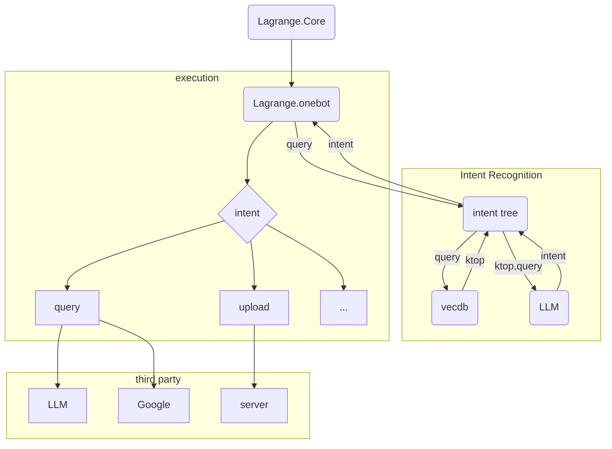

<div align="center">
> 简体中文 < | <a href="https://www.google.com/search?q=best+website+to+learn+chinese&newwindow=1&sca_esv=a76695392a9980a7&rlz=1C1CHBD_zh-HKHK1072HK1072&sxsrf=ADLYWIKib09skMzGw8JqpTv2AWB6Xk8uZQ%3A1716986674152&ei=MiNXZsP3COrk2roPt-SrgA0&oq=best+website+to+learn+chin&gs_lp=Egxnd3Mtd2l6LXNlcnAiGmJlc3Qgd2Vic2l0ZSB0byBsZWFybiBjaGluKgIIADIIEAAYgAQYywEyCBAAGIAEGMsBMggQABiABBiiBDIIEAAYgAQYogQyCBAAGIAEGKIEMggQABiABBiiBDIIEAAYgAQYogRItDNQtgNY3C5wAXgAkAEFmAHMBKABlzaqAQwwLjE4LjUuNC4wLjK4AQPIAQD4AQGYAhigAosmwgINECMYgAQYsAMYJxiKBcICDBAAGIAEGLADGAoYDMICERAuGIAEGLADGMcBGMsBGK8BwgIHEAAYsAMYHsICCRAAGLADGAgYHsICBBAjGCfCAhAQLhiABBjRAxhDGMcBGIoFwgIFEAAYgATCAgsQABiABBixAxiDAcICExAuGIAEGNEDGMcBGMkDGAoYywHCAgsQABiABBiSAxiKBcICBhAAGAgYHsICIhAuGIAEGNEDGMcBGMkDGAoYywEYlwUY3AQY3gQY4ATYAQHCAhcQLhiABBjHARiYBRiZBRjLARieBRivAcICERAuGIAEGNEDGMcBGMkDGMsBwgImEC4YgAQYxwEYmAUYmQUYywEYngUYrwEYlwUY3AQY3gQY4ATYAQHCAgYQABgeGA-YAwCIBgGQBgq6BgYIARABGBSSBwoxLjE2LjUuMS4xoAf2rwE&sclient=gws-wiz-serp" target="_blank">English</a>
</div>

## 结构

每一个服务都放在 ./node 中，根据各自的 readme 分别配置。

你需要准备的环境变量：

```bash
export DEEPSEEK_API_TOKEN=xxx
export OMCP_DISCORD_SERVER_IP=xxx
export OMCP_DISCORD_SERVER_PORT=xxx
export OMCP_DISCORD_TOKEN=xxx
```


---

## 架构



- `Lagrange.onebot` --> 📁bot
- `vecdb` --> 📁rag
- `intent tree` --> 📁prompt

---

## 接口规范

http 接口满足 `HttpResponse` 所示。

```typescript
interface HttpResponse<T> {
    code: number,
    data: CommonResponse<T>
}

interface CommonResponse<T> {
    code: number,
    data?: T,
    msg?: string
}
```

---

## 开发须知

- 非必要，请不要随意宣传本项目。
- 虽然曾经无数个 QQ 相关的项目都死了，但是基本的 API 端口算是传承了下来。拉格朗日的返回类型，请参考 [go-cqhttp 帮助中心 - API 篇](https://docs.go-cqhttp.org/api/) 中的内容。

---

## 启动

```bash
# 1. 启动 拉格朗日
tsc
pm2 start dist/main.js --name Lagrange.onebot
pm2 start rag/main.py --name rag
```

---

## 测试命令

### 重训练 embedding -> intent 分类层

```bash
curl -X POST http://127.0.0.1:8081/intent/retrain-embedding-mapping
```

### 获取意图

```bash
curl -X POST -H "Content-Type: application/json" -d '{"query": "真的开线程是要tcl指令去改的"}' http://127.0.0.1:8081/intent/get-intent-recogition
```

### 获取向量数据库中的 topk

```bash
curl -X POST -H "Content-Type: application/json" -d '{"query": "这个插件有什么比较好的文档吗？"}' http://127.0.0.1:8081/vecdb/similarity_search_with_score
```