<div align="center">
> 简体中文 < | <a href="https://www.google.com/search?q=best+website+to+learn+chinese&newwindow=1&sca_esv=a76695392a9980a7&rlz=1C1CHBD_zh-HKHK1072HK1072&sxsrf=ADLYWIKib09skMzGw8JqpTv2AWB6Xk8uZQ%3A1716986674152&ei=MiNXZsP3COrk2roPt-SrgA0&oq=best+website+to+learn+chin&gs_lp=Egxnd3Mtd2l6LXNlcnAiGmJlc3Qgd2Vic2l0ZSB0byBsZWFybiBjaGluKgIIADIIEAAYgAQYywEyCBAAGIAEGMsBMggQABiABBiiBDIIEAAYgAQYogQyCBAAGIAEGKIEMggQABiABBiiBDIIEAAYgAQYogRItDNQtgNY3C5wAXgAkAEFmAHMBKABlzaqAQwwLjE4LjUuNC4wLjK4AQPIAQD4AQGYAhigAosmwgINECMYgAQYsAMYJxiKBcICDBAAGIAEGLADGAoYDMICERAuGIAEGLADGMcBGMsBGK8BwgIHEAAYsAMYHsICCRAAGLADGAgYHsICBBAjGCfCAhAQLhiABBjRAxhDGMcBGIoFwgIFEAAYgATCAgsQABiABBixAxiDAcICExAuGIAEGNEDGMcBGMkDGAoYywHCAgsQABiABBiSAxiKBcICBhAAGAgYHsICIhAuGIAEGNEDGMcBGMkDGAoYywEYlwUY3AQY3gQY4ATYAQHCAhcQLhiABBjHARiYBRiZBRjLARieBRivAcICERAuGIAEGNEDGMcBGMkDGMsBwgImEC4YgAQYxwEYmAUYmQUYywEYngUYrwEYlwUY3AQY3gQY4ATYAQHCAgYQABgeGA-YAwCIBgGQBgq6BgYIARABGBSSBwoxLjE2LjUuMS4xoAf2rwE&sclient=gws-wiz-serp" target="_blank">English</a>
</div>


## 环境搭建

```bash
git clone xxxxxx
npm install pm2 -g
yarn
pip install -r requirements.txt
```

下载最新版本的 Lagrange.core ，并完成初始化。完成后根目录为

```
📁bot
📁rag
📁app
   ├─📁publish
   │  ├─🏷️...
   │  ├─🏷️appsettings.json
   │  └─🪛Lagrange.OneBot
   └─🎗️...
```

---

## 架构

```mermaid
graph LR
a(拉格朗日 NTQQ server) <-->|http,ws| b(onebot layer)

c(vecdb) -->|http| b
d(LLM) -->|http| b
```



---

## 接口规范

http 接口满足 `HttpResponse` 所示。

```typescript
interface HttpResponse<T> {
    code: number,
    data: CommonResponse<T>
}

interface CommonResponse<T> {
    code: number,
    data?: T,
    msg?: string
}
```

---

## 开发须知

- 非必要，请不要随意宣传本项目。
- 虽然曾经无数个 QQ 相关的项目都死了，但是基本的 API 端口算是传承了下来。拉格朗日的返回类型，请参考 [go-cqhttp 帮助中心 - API 篇](https://docs.go-cqhttp.org/api/) 中的内容。

